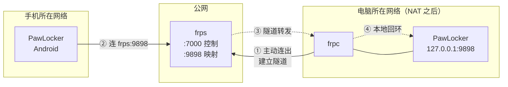
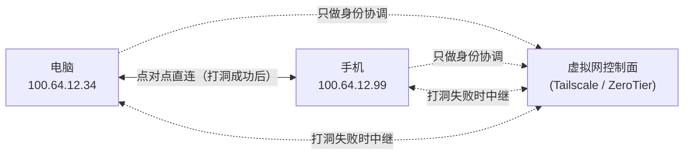
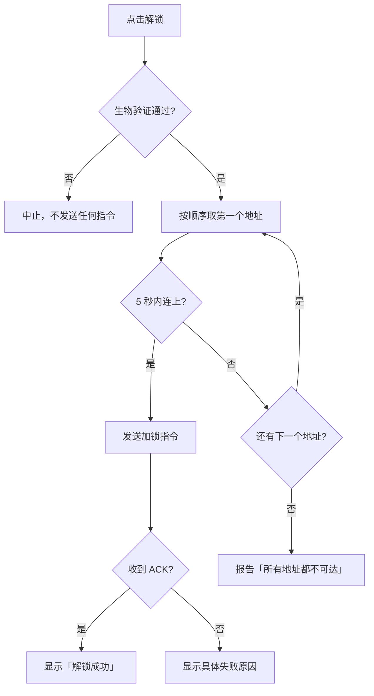

# 内网穿透与端口配置

本文回答一个问题：**手机到底往哪个地址发解锁指令，这个地址是怎么来的、坏了怎么修。**

## 1. 问题定义

电脑上的 `LockerServer` 监听一个 TCP 端口（默认 **9898**）。手机要发指令，就必须能对
`(host, port)` 建立 TCP 连接。这个 `host` 取决于两台设备各自站在哪里：

| 位置关系 | 手机能不能直连 `电脑内网IP:9898` |
|---|---|
| 同一个 Wi-Fi / 交换机 | 能，而且最快 |
| 不同网络，但都在同一个虚拟网 | 能，走虚拟网卡 |
| 手机在 4G/5G，电脑在路由器 NAT 后面 | **不能**，必须借助中转或打洞 |

所以「内网穿透」在本项目里不是必选项，而是**第三条兜底通道**。首选永远是直连 ——
不经过第三方、延迟最低、没有额外暴露面。

## 2. 三条通道一览

| 通道 | 适用场景 | 需要什么 | 典型延迟 | 额外暴露面 |
|---|---|---|---|---|
| **局域网直连** | 手机和电脑在同一个 Wi-Fi | 无 | 1–5 ms | 无 |
| **虚拟组网** | 经常在外网用，但不信任自建服务器 | 装 Tailscale / ZeroTier | 20–80 ms | 虚拟网内可见 |
| **内网穿透（frp）** | 需要给不装客户端的环境用，或想要完全自控 | 一台有公网 IP 的服务器 | 30–150 ms | 公网端口对外开放 |

三条通道**可以同时启用**，电脑端会在配对时把它们都下发给手机，手机按顺序逐个尝试。

## 3. 通道 A —— 局域网直连

零配置。电脑端配对时用 `PlatformEnv.localIpv4Addresses()` 枚举本机所有非回环 IPv4 地址，
连同端口一起放进配对响应里。

多网卡机器（Docker、虚拟机、双网卡）会枚举出一堆**手机根本连不通**的地址，
手机端逐個尝试这些死地址会让「连接」这一步慢好几秒。所以在设置页里可以手动指定：

```
设置 → 局域网直连 → 指定内网地址
```

填了之后只下发这一个地址。留空表示自动枚举全部。

> ⚠️ 电脑端会**过滤掉**回环地址和 `169.254.x.x`（APIPA 自动私有地址），
> 但不会过滤 Docker 的 `172.17.x.x` —— 那个网段和真实局域网无法从地址本身区分，
> 只能靠用户指定。

## 4. 通道 B —— frp 反向代理

### 4.1 拓扑



关键点：**frpc 是主动往外连的**。router 的 NAT 只拦截「从外面进来的连接」，
不拦「从里面出去的连接」。所以电脑不需要任何端口转发规则，也不需要公网 IP。

### 4.2 为什么选 frp

| 候选 | 结论 | 原因 |
|---|---|---|
| **frp** | ✅ 采用 | 单二进制、TOML 配置、支持 TLS 与 token 鉴权、社区活跃、自托管无第三方依赖 |
| UPnP / NAT-PMP | ❌ 放弃 | 需要路由器开启 UPnP，而这个协议本身就是历史上大量漏洞的来源；且很多运营商光猫不给权限 |
| Cloudflare Tunnel | ❌ 放弃 | 要求把域名托管到 Cloudflare；免费版对任意 TCP 的支持受限；引入了一个能看到连接元数据的中间方 |
| 直接做端口转发 | ❌ 放弃 | 把 `9898` 直接暴露在公网。虽然业务载荷是端到端加密的，但暴露面的扩大没有换来任何好处 —— 扫描器会持续敲门，日志里全是噪声 |
| 自建 TCP 中继 | ❌ 放弃 | 等于重新实现 frp，且要自己解决重连、保活、TLS |

### 4.3 服务端 frps 最小配置

在**有公网 IP 的那台服务器**上：

```toml
# /etc/frp/frps.toml
bindPort = 7000

auth.method = "token"
auth.token = "换成一串足够长的随机值"

# 只允许映射预先登记过的端口，避免被当成开放代理
allowPorts = [
  { start = 9898, end = 9898 },
]
```

启起来：

```bash
./frps -c /etc/frp/frps.toml
```

记得在服务器安全组 / 防火墙上放行 `7000/tcp` 和 `9898/tcp`。

### 4.4 电脑端生成的 frpc.toml

电脑端**不内置 frpc 二进制**，它只负责按配置生成一份 `frpc.toml`，
然后用你指定的 `frpc.exe` 路径把它拉起来。生成的文件长这样：

```toml
# 由 PawLocker 自动生成，请勿手工编辑 —— 修改会在下次启动时被覆盖
serverAddr = "frp.example.com"
serverPort = 7000
loginFailExit = false

[auth]
method = "token"
token = "与 frps.toml 里一致的随机值"

[transport.tls]
enable = true

[[proxies]]
name = "pawlocker-9898"
type = "tcp"
localIP = "127.0.0.1"
localPort = 9898
remotePort = 9898
transport.useEncryption = true
transport.useCompression = false
```

逐项解释为什么要这么写：

| 字段 | 取值 | 理由 |
|---|---|---|
| `loginFailExit` | `false` | frps 暂时不可达时不要退出。手机解锁是「偶尔用一次」的场景，frpc 挂了没人会发现 |
| `localIP` | `127.0.0.1` | 只回环转发。写成 `0.0.0.0` 会让流量绕一圈局域网，没有任何好处 |
| `transport.useEncryption` | `true` | frp 自带的一层加密。注意这**不能替代**协议层的端到端加密，只是让隧道内容对 frps 也不透明 |
| `transport.useCompression` | `false` | 载荷本身很小（几百字节），压缩只会增加 CPU 开销和延迟 |
| `[transport.tls]` | 视情况 | frpc 与 frps 之间的 TLS。当 `serverAddr` 是公网域名时建议开启 |

> `remotePort` 与 `subdomain` 二选一。如果你的 frps 配了 `subDomainHost`，
> 用子域名更干净（不需要在服务端预留端口）。否则就用端口映射。

### 4.5 安全清单

启用 frp 之前，逐条确认：

- [ ] `auth.token` 是**随机生成**的，不是 `123456` 之类
- [ ] frps 的 `allowPorts` 限制了可映射范围，没有全开
- [ ] 只映射了 `9898` 这一个端口，没有顺手把 `3389`/`22` 也映出去
- [ ] `transport.tls.enable = true`
- [ ] 服务器上的 frps 以**非 root** 用户运行
- [ ] 打开 PawLocker 的「运行日志」页，能看到「连接」事件来自和你预期一致的频率

如果某天日志里出现大量来源不明的连接尝试，先怀疑 frp 端口被扫了 ——
这时**业务层是安全的**（没有配对过的设备连签名都过不了），但值得去服务器上看看。

## 5. 通道 C —— 虚拟组网

Tailscale / ZeroTier / WireGuard 把手机和电脑放进同一个虚拟网，各自拿到一个固定内网地址。



**什么时候它比 frp 更好：**

- 不想维护一台有公网 IP 的服务器
- 电脑端不需要常驻任何额外进程（Tailscale 客户端本来就在跑）
- 没有「公网端口对外开放」这件事，扫描器根本看不到你
- 大部分情况下能打洞成点对点直连，延迟比走中继更低

**什么时候它不适用：**

- 要给一台不方便装客户端的机器解锁
- 组网服务本身被限制（企业网络、某些地区）
- 你不想引入第三方控制面

配置方式：

```
设置 → 虚拟组网 → 启用虚拟组网通道 → 选择服务商 → 填虚拟网卡地址
```

`virtualHost` 填 Tailscale 分配的 `100.x.y.z` 地址，或者 MagicDNS 名称
（形如 `desktop-kira.tailnet-xxxx.ts.net` —— 用名字更好，换网络时地址会变，名字不会）。

## 6. 端口配置在哪儿改

| 想改什么 | 去哪儿改 | 生效时机 |
|---|---|---|
| 监听端口（默认 9898） | 设置 → 监听 → 监听端口 | 需要点「重启服务」 |
| 绑定网卡（默认 `0.0.0.0`） | 同上 | 需要点「重启服务」 |
| 要宣告的内网地址 | 设置 → 局域网直连 | 下次生成配对码时生效 |
| frp 服务器地址 / token / 映射端口 | 设置 → 内网穿透 | 需要点「重启服务以应用更改」 |
| frpc 可执行文件路径 | 设置 → 内网穿透 → frpc 可执行文件 | 需要重启服务 |
| 虚拟网卡地址 | 设置 → 虚拟组网 | 下次生成配对码时生效 |

**手机端永远不需要改端口配置。** 配对成功后，电脑会把当前所有可达地址下发给手机并
存进信任记录。之后改端口、加一条 frp、换虚拟网地址，都只要在电脑端改一次，
下次配对时同步 —— 而已配对的设备需要重新配对才会拿到新地址（这是有意的，
避免「改了地址但手机还在用旧的」这种静默失败）。

## 7. 优先级与回退

电脑端在配对响应里下发的地址列表**有顺序**，顺序由 `Endpoint.preferredOrder` 决定：

```
局域网直连  →  虚拟组网  →  内网穿透
  (rank 0)      (rank 1)      (rank 2)
```

就近优先：同一个 Wi-Fi 下没必要绕去公网服务器。

手机端拿到列表后**串行尝试**，第一个连上的就停：



单个地址的连接超时是 5 秒。这是在「局域网地址响应慢」和「公网地址连不上要快些放弃」
之间取的折中 —— 三条通道全部失败最坏情况约 15 秒。

## 8. 排障清单

**手机显示「所有地址都不可达」**

1. 电脑端「运行日志」页有没有「连接」记录？没有 → 请求根本没到电脑，问题在网络层
   - 局域网：确认两台设备在同一个网段（手机连的是不是同一个 Wi-Fi？有些路由器 2.4G/5G 分网段）
   - frp：`frpc` 进程还活着吗？看「运行日志」里隧道那条状态
   - 虚拟组网：在手机浏览器里 ping 一下虚拟网地址
2. 有连接记录但立刻断开 → 大概率是防火墙。设置 → Windows 注册状态 → 看「入站防火墙规则」是不是「待处理」，点「放行」

**配对时扫二维码失败，但手动输入能成功**

二维码内容里带的是深链，如果由第三方应用打开可能被截断。手动输入主机地址 + 端口 + 配对码
走的是同一条协议路径，安全性完全等价。详见 `04-interaction-details.md`。

**电脑重启后手机就连不上了**

- 局域网：路由器 DHCP 给电脑分了新 IP。解决方式是给电脑配静态 IP，或者启用虚拟组网
- frp：`frpc` 没起来。检查设置里的「随应用自动启动 frpc」是否开着，
  以及「Windows 注册状态」里的「开机自动运行」是否「已就绪」
